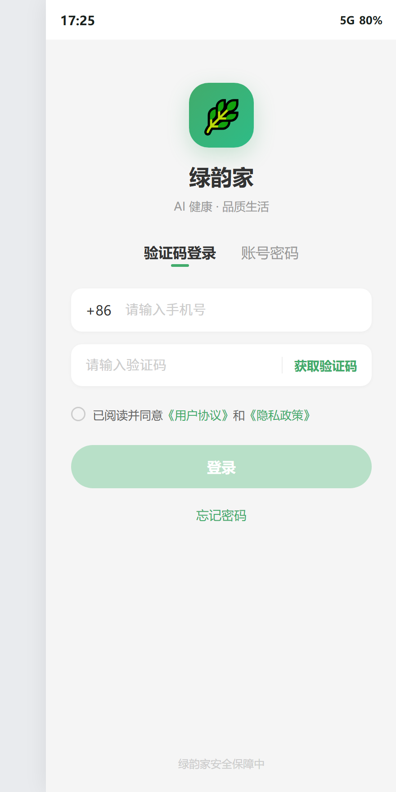
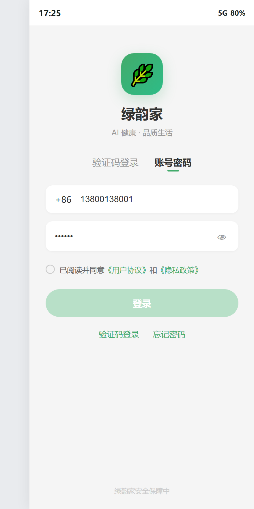
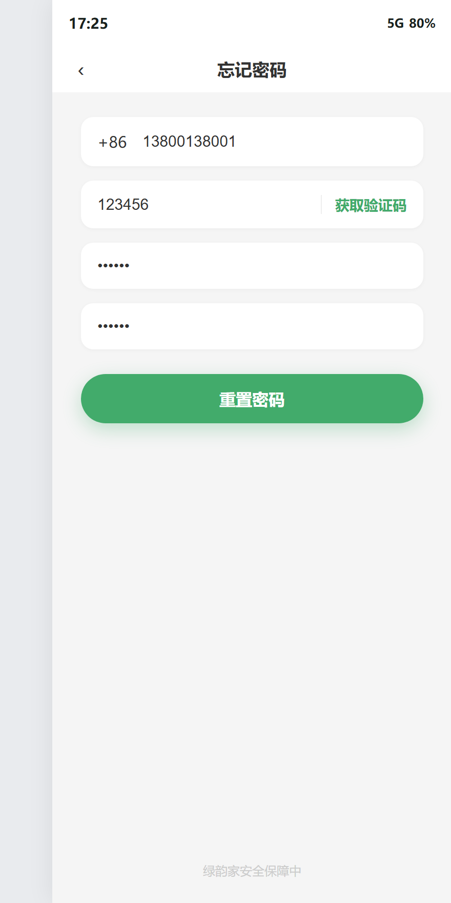
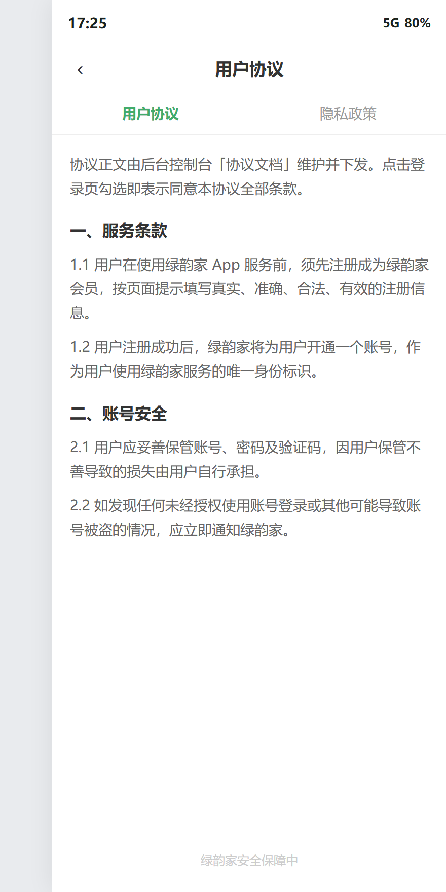

# 绿韵家 App · 登录注册需求文档（PRD）

> **模块编号**：TASK-20260812-0061 ｜ **一级模块**：首页 ｜ **优先级**：P0 ｜ **端口**：App（Flutter + H5 混合页）
> **技术栈**：Flutter（H5 混合页承载协议详情）｜ AI：复用泰小虎 / Coze 能力（登录注册无 AI 交互）
> **需求状态**：本期新增/改动 ｜ **文档版本**：V1.0
> **关联文档**：`spec.md`、`kb/page-catalog.md`、`kb/function-inventory.md`
> **原型文件**：`prototypes/app-login-v2.html`

---

## 一、文档基本信息

| 字段 | 内容 |
|------|------|
| 项目名称 | 绿韵家 App 重构（2026年8月期） |
| 需求模块 | 登录注册 |
| 看板任务 | TASK-20260812-0061 |
| PM 负责人 | 袁中天 |
| 技术 Owner | （⚠️ 待确认 @宋健） |
| 测试负责人 | （⚠️ 待确认 @高旗·刘平·李哲） |
| 文档状态 | 需求确认稿（待评审） |

### 历史修订记录

| 版本 | 日期 | 修订内容 | 状态 |
|------|------|---------|------|
| V1.0 | 2026-08-13 | 初稿：按一~九结构补全，嵌入原型截图 | 待评审 |

---

## 二、项目背景与目标

### 2.1 业务背景

绿韵家由前身「有享猫」重构为 **AI 电商 App**。登录注册是 App 冷启动后的第一道关口，直接影响新用户转化与老用户（原小程序）迁移体验。本期 App 端需重新设计登录注册流程，明确：

- **仅支持手机号 + 验证码登录**，首次验证即自动注册；
- **默认无登录密码**，故不提供密码注册，但保留密码登录入口供已设密码的老用户使用；
- **登录前必须勾选同意**《用户协议》《隐私政策》；
- **不做微信授权快捷登录**（App 微信授权需单独开放平台资质，与小程序 appid 不同主体，一期资源不足）。

### 2.2 项目目标

| 目标 | 衡量指标 |
|------|---------|
| 降低新用户注册门槛 | 首次验证码登录即完成注册，无需额外设置密码 |
| 保障老用户平滑迁移 | 同一手机号登录后识别为已有账号，权益/订单不丢失 |
| 合规前置 | 登录前完成用户协议与隐私政策勾选，未勾选拦截 |
| 控制一期范围 | 不引入微信授权登录、不强制设置密码 |

### 2.3 业务要求

- 登录态 token 有效期、刷新机制沿用现有小程序/后台会话体系（⚠️ 待确认 @宋健）。
- 协议正文由后台控制台「协议文档」维护并下发，App 端直接取值渲染，**本期不单独起草协议正文**。

---

## 三、业务流程与架构

### 3.1 整体登录流程说明

> ⚠️ 权威业务流图示待需求梳理阶段产出并确认。本处以文字方式描述主流程，待权威横向泳道/全链路业务流图示确认后替换为引用。

1. **App 冷启动**：检测登录态；已登录则进入首页，未登录则进入登录页。
2. **登录页**：默认展示验证码登录。
3. **输入手机号**：点击「获取验证码」，前端校验手机号格式，校验通过后调用服务端发送验证码接口。
4. **60s 倒计时**：前端禁用重复获取，服务端同步做频控。
5. **输入验证码**：用户输入收到的短信验证码。
6. **勾选协议**：点击 checkbox 同意《用户协议》《隐私政策》。
7. **点击登录**：依次校验「协议是否勾选」「手机号是否合法」「验证码是否完整」。
8. **后端校验**：手机号未注册 → 自动创建账号并登录；已注册 → 直接登录。
9. **登录成功**：返回 token，跳转首页。

### 3.2 状态机

| 状态 | 触发条件 | 说明 |
|------|---------|------|
| 未登录 | App 冷启动 / 用户主动登出 | 展示登录页 |
| 登录中 | 点击登录后、后端返回前 | 按钮 loading（本期由 Flutter 统一 loading 控制） |
| 已登录 | 后端返回有效 token | 进入首页，token 持久化 |
| 协议未勾选 | 初始态 | 登录按钮置灰，点击登录 Toast 拦截 |
| 协议已勾选 | 用户点击 checkbox | 登录按钮在满足其他条件时可用 |

### 3.3 信息架构

| 页面/弹窗 | 入口 | 出口 |
|-----------|------|------|
| 登录页（验证码） | App 冷启动、主动退出登录 | 首页、账号密码登录、忘记密码、协议页 |
| 登录页（账号密码） | 登录页 tab 切换 | 首页、验证码登录、忘记密码、协议页 |
| 忘记密码页 | 登录页「忘记密码」 | 返回登录页 |
| 协议页 | 登录页协议链接 | 返回登录页 |
| 全局 Toast | 校验失败 / 操作反馈 | 自动消失 |

---

## 四、功能需求详情

### 4.0 需求影响范围

| 影响项 | 说明 |
|--------|------|
| 涉及终端 | App 端（Flutter）为主；协议详情页可用 H5 混合页承载 |
| 本期新增/改动 | 登录注册流程、验证码登录自动注册、协议勾选前置、忘记密码 |
| 沿用现有功能 | 短信发送接口复用现有验证码逻辑（60s 频控 + 服务端限制） |
| 关联后台 | 会员账号接口、短信验证码接口、协议文档接口 |
| 不做项 | 微信授权登录、密码注册、登出/注销/换绑手机号（待确认是否纳入一期） |

### 4.1 登录页（验证码登录）

#### 4.1.1 页面原型与交互示意

#### 4.1.2 界面与展示规则

| 元素 | 展示规则 | 备注 |
|------|---------|------|
| 品牌区 | 顶部居中展示品牌 logo +「绿韵家」+ slogan「AI 健康 · 品质生活」 | 品牌视觉以设计规范为准 |
| 登录方式 tab | 「验证码登录」「账号密码」两 tab，默认验证码登录高亮 | 点击切换登录方式 |
| 手机号输入 | 左侧固定「+86」，右侧输入 11 位手机号 | 类型为 tel，maxlength=11 |
| 验证码输入 | 左侧输入框，右侧「获取验证码」按钮 | 类型为 tel，maxlength=6 |
| 协议勾选行 | 圆形 checkbox +「已阅读并同意《用户协议》《隐私政策》」 | 链接可点击跳转协议页 |
| 登录按钮 | 默认置灰；手机号合法 + 验证码 ≥4 位 + 已勾选协议 时高亮可用 | 主按钮样式 |
| 忘记密码 | 登录按钮下方辅助链接 | 跳转忘记密码页 |

#### 4.1.3 业务逻辑与边界条件

**一、获取验证码**

| 步骤 | 操作 | 前置条件 | 异常/校验 | 提示文案 |
|------|------|---------|----------|---------|
| 1 | 用户输入手机号 | 手机号输入框已获得焦点 | — | — |
| 2 | 点击「获取验证码」 | — | 手机号为空 | Toast「请输入手机号」 |
| 3 | 前端校验手机号格式 | 11 位，1[3-9] 开头 | 格式非法 | Toast「请输入正确的手机号码」 |
| 4 | 调用 `POST /api/sms/send` | 校验通过 | 服务端频控/异常 | Toast「操作过于频繁，请稍后再试」或接口返回文案 |
| 5 | 前端 60s 倒计时 | 调用成功 | — | 按钮文案变为「59s」「58s」…直至可重新获取 |

**二、登录提交**

| 步骤 | 操作 | 前置条件 | 异常/校验 | 提示文案 |
|------|------|---------|----------|---------|
| 1 | 点击「登录」 | — | 未勾选协议 | Toast「请先阅读并同意用户协议与隐私政策」 |
| 2 | 校验手机号 | 已勾选协议 | 手机号为空/格式非法 | Toast「请输入正确的手机号码」 |
| 3 | 校验验证码 | 手机号合法 | 验证码为空/位数不足 | Toast「请输入正确的验证码」 |
| 4 | 调用 `POST /api/auth/login-by-code` | 校验通过 | 验证码错误/过期 | Toast「验证码错误或已过期」 |
| 5 | 后端处理 | 手机号未注册 → 自动创建账号并登录；已注册 → 直接登录 | 账号异常/被封禁 | 接口返回具体文案 |
| 6 | 保存 token，跳转首页 | 登录成功 | — | Toast「登录成功」 |

### 4.2 登录页（账号密码登录）

#### 4.2.1 页面原型与交互示意

#### 4.2.2 界面与展示规则

| 元素 | 展示规则 | 备注 |
|------|---------|------|
| 登录方式 tab | 「验证码登录」「账号密码」，账号密码 tab 高亮 | 点击切换 |
| 手机号输入 | 左侧「+86」，右侧输入手机号 | 仅支持手机号，不支持邮箱/用户名 |
| 密码输入 | 默认密文，右侧眼睛图标可切换明文/密文 | maxlength=20 |
| 协议勾选行 | 同 4.1.2 | — |
| 登录按钮 | 手机号合法 + 密码 ≥6 位 + 已勾选协议 时高亮 | — |
| 辅助链接 | 「验证码登录」「忘记密码」 | — |

#### 4.2.3 业务逻辑与边界条件

| 步骤 | 操作 | 前置条件 | 异常/校验 | 提示文案 |
|------|------|---------|----------|---------|
| 1 | 点击「登录」 | — | 未勾选协议 | Toast「请先阅读并同意用户协议与隐私政策」 |
| 2 | 校验手机号 | 已勾选协议 | 手机号非法 | Toast「请输入正确的手机号码」 |
| 3 | 校验密码 | 手机号合法 | 密码为空/少于6位 | Toast「密码不能少于6位」 |
| 4 | 调用登录接口 | 校验通过 | 账号不存在/密码错误 | 接口返回具体文案（如「账号或密码错误」） |
| 5 | 保存 token，跳转首页 | 登录成功 | — | Toast「登录成功」 |

### 4.3 忘记密码页

#### 4.3.1 页面原型与交互示意

#### 4.3.2 界面与展示规则

| 元素 | 展示规则 | 备注 |
|------|---------|------|
| 顶部导航 | 返回箭头 +「忘记密码」 | 点击返回登录页 |
| 手机号输入 | 同 4.1.2 | — |
| 验证码输入 | 同 4.1.2 | — |
| 新密码输入 | 占位文案「设置新密码（6-20位）」 | 密文 |
| 确认新密码 | 占位文案「确认新密码」 | 密文 |
| 重置按钮 | 手机号合法 + 验证码 ≥4 位 + 两次密码一致且 ≥6 位 时高亮 | — |

#### 4.3.3 业务逻辑与边界条件

| 步骤 | 操作 | 前置条件 | 异常/校验 | 提示文案 |
|------|------|---------|----------|---------|
| 1 | 输入手机号并获取验证码 | 手机号合法 | 非法手机号 | Toast「请输入正确的手机号码」 |
| 2 | 输入新密码与确认密码 | — | 两次输入不一致 | Toast「两次输入的密码不一致」 |
| 3 | 点击「重置密码」 | 两次密码一致且 ≥6 位 | 验证码错误 | Toast「验证码错误或已过期」 |
| 4 | 调用重置接口 | 校验通过 | 服务端异常 | 接口返回具体文案 |
| 5 | 重置成功返回登录页 | — | — | Toast「密码重置成功」 |

### 4.4 协议页

#### 4.4.1 页面原型与交互示意

#### 4.4.2 界面与展示规则

| 元素 | 展示规则 | 备注 |
|------|---------|------|
| 顶部导航 | 返回箭头 + 当前协议标题 | — |
| tab 切换 | 「用户协议」「隐私政策」 | 点击切换正文 |
| 协议正文 | 后台控制台「协议文档」下发 | 本期不在客户端写死协议正文 |

#### 4.4.3 业务逻辑与边界条件

- 登录页点击「《用户协议》」跳转协议页并默认选中「用户协议」tab。
- 登录页点击「《隐私政策》」跳转协议页并默认选中「隐私政策」tab。
- 协议页返回时回到原登录页（验证码或密码），保留已输入内容与勾选状态。
- ⚠️ 协议正文来源：后台「控制台→协议文档」已维护 APP用户协议 / APP隐私政策（2025-11-13 已存），App 端直接取值渲染。

---

## 五、非功能性需求

### 5.1 埋点需求

埋点规范引用《泰小虎埋点规范 v2.3》。本期登录注册模块涉及事件如下：

| 事件英文名 | 显示名 | 层 | 平台 | 触发时机 | 必含参数 | 备注 |
|-----------|--------|-----|------|---------|---------|------|
| login_page_view | 登录页曝光 | L2 | App | 登录页可见 | page_name | — |
| login_get_code_click | 获取验证码点击 | L2 | App | 点击获取验证码 | login_type | — |
| login_submit_click | 登录按钮点击 | L2 | App | 点击登录按钮 | login_type | code/pwd |
| login_success | 登录成功 | L2 | App | 服务端返回成功 | is_new_user | 0/1 |
| login_fail | 登录失败 | L2 | App | 服务端返回失败 | fail_reason | — |
| agreement_view | 协议页查看 | L2 | App | 协议页可见 | agreement_type | user/privacy |
| agreement_agree_click | 协议勾选 | L2 | App | 点击协议 checkbox | is_checked | 0/1 |

> 注：事件英文名/参数名须与埋点平台最终命名对齐（⚠️ 待确认 @埋点负责人）。

### 5.2 性能要求

- 登录页首屏加载时间 ≤ 1.5s（不含网络）。
- 获取验证码接口响应时间 P99 ≤ 2s。
- 登录接口响应时间 P99 ≤ 1.5s。

### 5.3 安全要求

- 验证码 60s 倒计时 + 服务端频控（同手机号、同设备、同 IP 限制）。
- 密码传输须加密（⚠️ 待确认 @宋健 具体加密方案）。
- token 本地存储须加密，支持刷新与失效清理。

### 5.4 兼容性要求

- 适配 iOS 12+ / Android 8+ 主流机型。
- 适配刘海屏、底部安全区。

---

## 六、验收标准

- [ ] 新手机号首次验证码登录后自动注册，可进入首页，会员库生成新记录。
- [ ] 已注册手机号验证码登录/密码登录均可正常进入首页，历史订单、权益、积分不丢失。
- [ ] 未勾选协议时点击登录，全局 Toast 提示「请先阅读并同意用户协议与隐私政策」，不触发登录接口。
- [ ] 手机号为空/格式非法/验证码为空/验证码错误/过期时，均给出对应 Toast 提示。
- [ ] 获取验证码按钮 60s 倒计时正确，倒计时期间不可重复点击。
- [ ] 账号密码登录时，密码支持明文/密文切换，密码错误时给出明确提示。
- [ ] 忘记密码流程：手机号校验 → 验证码校验 → 两次密码一致校验 → 重置成功返回登录页。
- [ ] 协议页可正常查看用户协议与隐私政策，返回后保留登录页输入状态与勾选状态。
- [ ] 登录成功后 token 持久化，App 杀进程再启动保持登录态（token 未过期前提下）。

---

## 七、关键边界设计检查清单

| 检查项 | 结论 | 说明 |
|--------|------|------|
| 状态机完整性 | ✅ | 未登录 / 登录中 / 已登录；协议未勾选 / 已勾选 |
| 破坏性操作前置 | ✅ | 无账号注销/删除等破坏性操作 |
| 表单校验顺序 | ✅ | 协议勾选 → 手机号 → 验证码/密码 |
| 异常分支覆盖 | ✅ | 空值、格式、验证码错误、密码错误、服务端异常 |
| 数据一致性 | ✅ | 登录成功 token 持久化，协议勾选状态跨页保留 |
| 安全合规 | ✅ | 验证码频控、密码传输加密（待确认方案）、协议前置勾选 |
| 埋点完整性 | 🟡 | 事件列表已列，字段命名待埋点负责人确认 |
| 兼容性 | 🟡 | 待 Flutter 端按设备矩阵验证 |

---

## 八、文档维护与变更规范

1. **变更审批**：本 PRD 任何改动须经过 PM 与开发负责人确认，并在「历史修订记录」中登记。
2. **原型截图同步**：原型文件 `prototypes/app-login-v2.html` 改版后，须同步重新截取 `prd-assets/login-*.png` 并更新本 PRD 配图。
3. **待确认项闭环**：本文档中所有「⚠️ 待确认 @干系人」须在评审会前确认并替换为确定内容，未闭环项不得进入开发。
4. **协议文档**：用户协议 / 隐私政策正文由后台维护，如后台协议内容更新，App 端无需改动 PRD，但需确保取值路径正确。
5. **关联看板**：本需求与看板 `绿韵家V2.0看板.xlsx` 里程碑1「APP-首页-登录注册」行保持一致。

---

## 九、待确认项汇总

1. **技术 Owner / 测试负责人**：PRD 一、文档基本信息中技术 Owner 与测试负责人待确认。
2. **token 刷新机制**：登录态 token 有效期、刷新机制是否沿用现有小程序/后台会话体系（@宋健）。
3. **密码传输加密方案**：账号密码登录与忘记密码时密码传输加密方式（@宋健）。
4. **埋点事件命名**：登录注册模块事件英文名/参数名是否与埋点平台最终命名对齐（@埋点负责人）。
5. **登出 / 注销 / 换绑手机号**：是否纳入一期范围（@袁中天 / 老板决策）。
6. **推荐人绑定（拉新）**：App 登录注册时是否保留推荐人绑定逻辑（@袁中天 / 运营）。
