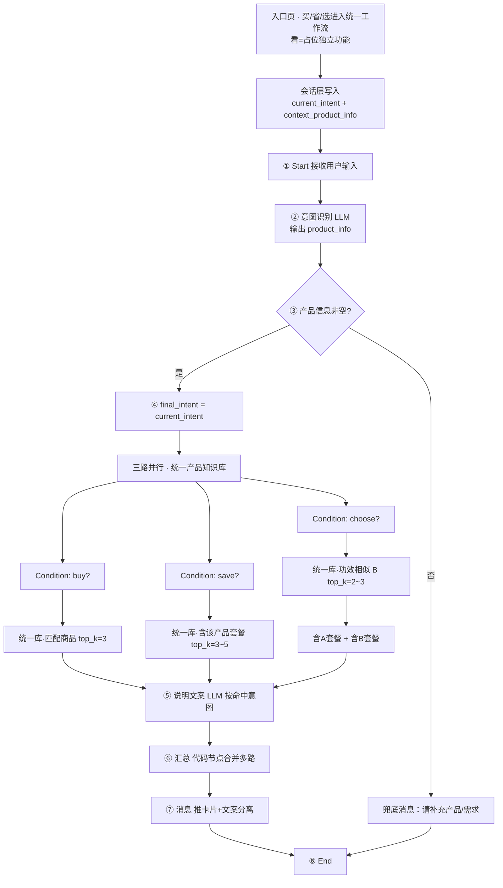

# 绿韵家数智工作流统一架构（帮我买 / 帮我省 / 帮我选）

> 给技术评审稿 · 2026-09-10 · 合并自《价格对照方案》《帮我买 Coze 节点图》《帮我省草案》
> 本次修正：明确入口页 4 卡片、意图切换规则、「帮我看」为占位独立功能。

## 一、背景与范围

- 三个功能（帮我买 / 帮我省 / 帮我选）**不是独立工作流**，而是同一套「无上下文对话工作流」下的**多意图并行**分支。
- 用户无上下文：单轮输入、不维护历史、不追问。
- 入口页共有 4 个卡片（见第二节），其中「帮我看」是占位/独立功能，**不进本工作流**；仅「帮我买 / 帮我省 / 帮我选」走统一工作流。

## 二、入口页与意图切换规则（修正）

### 2.1 入口页 4 卡片

| 入口卡片 | 是否进入统一工作流 | 说明 |
|---|---|---|
| AI 帮你「看」 | **否（占位）** | 看舌/看报告/体质检测，独立功能，本期不讨论 |
| AI 帮你「买」 | 是 | 匹配商品 → 推商品卡片 |
| AI 帮你「省」 | 是 | 关联套餐 → 推套餐卡片 |
| AI 帮你「选」 | 是 | 功效对比 → 推 B 产品 + 含 A/B 套餐 |

### 2.2 意图切换机制

用户点入口后，会话层写入两条状态：

| 状态 | 说明 | 更新规则 |
|---|---|---|
| `current_intent` | 当前意图 = buy / save / choose（初始为 null） | **初始 null；首次点入口写入；之后每轮沿用，直到用户点其他入口覆盖** |
| `context_product_info` | 上下文产品信息（症状 / 功效 / 商品名） | **跨意图保留，可被本轮输入覆盖** |

每次用户发消息，统一工作流读取：

- `current_intent`
- `user_input`（本轮输入）
- `context_product_info`（上一轮的产品上下文）

工作流内部规则：

1. 意图识别节点先抽取本轮 `product_info`。
2. 若本轮 `product_info` 为空，则复用 `context_product_info`。
3. 若两者都为空，直接走兜底文案，**不追问**。
4. 最终执行分支由 `current_intent` 决定（buy / save / choose），不是由 LLM 自由识别。

### 2.3 典型切换场景

- **场景 A**：点「买」说"想买助眠的" → 再点「省」：`current_intent` 由 buy 变 save，`context_product_info={助眠}` 保留 → 直接推含助眠商品的套餐。
- **场景 B**：在「省」里又说"那 B 产品呢" → 本轮 `product_info={B}`，`context_product_info` 同步覆盖 → 继续按 save 查 B 的关联套餐。
- **场景 C**：从「买」切到「选」：`current_intent` 变 choose，保留产品 A → 按 choose 逻辑推功效对比的 B + 含 A/B 套餐。

## 三、核心架构决策

1. **统一一个产品知识库**：含所有商品 + 所有套餐（字段 `type=single/combo`，combo 带 `contains` 字段标含哪些单品）。不再分商品库 / 套餐库 / 候选库。
2. **入口点击切换意图，产品上下文跨意图保留**：`current_intent` 每次点入口覆盖；`context_product_info` 跨 buy/save/choose 保留，可被本轮输入覆盖。
3. **上下文是否有产品信息是前置判断**：意图识别抽取 `product_info` 后，先判是否非空；空 → 直接兜底（不追问），非空 → 才进 buy/save/choose 三路并行。
4. **三个意图可同轮并行触发**（如用户说「想买安眠的、有没有更省的」→ buy+save 同时命中）。
5. **帮我选逻辑**：结合上下文产品 A，经帮我选推荐功效对比的 B 产品，并推荐「含 A 产品的套餐」+「含 B 产品的套餐」（见第六节）。

## 四、统一工作流节点图（Coze 可配置）



## 五、节点配置对照表（Coze）

| 序号 | 节点 | Coze 类型 | 关键配置 | 输出 |
|---|---|---|---|---|
| 会话层 | 入口点击 | App 会话状态 | 写入 `current_intent` + 保留/复用 `context_product_info` | 状态 |
| ① | Start | 开始 | 接收用户输入 query；读取 `current_intent` 与 `context_product_info` | query, current_intent, context_product_info |
| ② | 意图识别 | 大模型 LLM | 提示词要求输出 JSON `{product_info}` | product_info |
| ③ | 产品信息判断 | 条件分支 Condition | `product_info` 非空? | 分支 true / false |
| 兜底 | 兜底消息 | 消息 Message | 「没有召回相关产品，请补充信息或换个说法」 | 文本 |
| ④ | 最终意图 | 代码节点 | `final_intent = current_intent` | final_intent |
| buy | 商品检索 | 知识库检索 | 统一库, top_k=3, query=product_info | 商品列表 |
| save | 套餐检索 | 知识库检索 | 统一库 filter `type=combo` 且含该产品, top_k=3~5 | 套餐列表 |
| choose-B | B 产品检索 | 知识库检索 | 统一库 功效相似, top_k=2~3 | B 产品 |
| choose-套餐 | 套餐检索 | 知识库检索 | 统一库 `contains=A` / `contains=B` | 套餐列表 |
| ⑤ | 说明文案 | 大模型 LLM | 按命中意图生成定性文案 | 文案 |
| ⑥ | 汇总 | 代码节点 | 合并多路结果 | 合并结构 |
| ⑦ | 消息 | 消息 Message | 卡片（跳详情）+ 文案分离 | 推送 |
| ⑧ | End | 结束 | — | — |

## 六、三个意图逻辑说明

### 帮我买（buy）

- 触发：用户明确要买 / 找某商品；或当前 `current_intent=buy`。
- 检索：统一产品知识库按 `product_info` 召回匹配商品，`top_k=3`。
- 输出：商品卡片（跳详情）+ 定性说明文案。

### 帮我省（save）

- 触发：用户想省钱 / 找更划算方案；或当前 `current_intent=save`。
- 检索：统一库过滤 `type=combo` 且包含该产品的套餐，`top_k=3~5` 最相关。
- 输出：关联套餐卡片 + 文案「套餐 X 包含 A/B/C，相比单买更加省钱」（**不显示具体省 ¥XX**，呼应价格方案 v2）。

### 帮我选（choose）

- 触发：基于上下文已有产品 A，用户纠结哪款；或当前 `current_intent=choose`。
- 检索①：统一库召回功效相似 / 对比的 B 产品（`top_k=2~3`）。
- 检索②：分别召回「含 A 产品的套餐」+「含 B 产品的套餐」。
- 输出：A vs B 功效对比说明 + 含 A 套餐卡片 + 含 B 套餐卡片。

## 七、价格对照方案（套餐 vs 单品，合并旧稿）

- **难点**：套餐总价高、单品总价低，量纲不同，直接比总价无意义。
- **核心思路**：折算单价 / 套餐节省前置到知识库录入（切片 pipeline）阶段算好，工作流只调字段、不实时计算。字段由切片自动注入，用户 / 业务无需填写。
- **建议新增字段**：`type` / `contains` / `equivalent_unit_price`（折算单价）/ `saving_vs_single`（套餐比单买省，由切片算好）。
- **文案与卡片分离**：卡片只放名称 / 价格 / 卖点用于点击跳转；文案用定性自然语言（如「套餐更划算」），不强制显示具体省 ¥XX。
- **未命中处理**：三路均 Condition=false（含无产品信息）→ 兜底文案「没有召回相关产品，请补充信息或换个说法」。
- **召回与排序规则**：待定（后续补）。

## 八、待技术确认清单

1. 会话层是否能写入并维护 `current_intent` 与 `context_product_info` 两条状态？（App 端还是 Coze 端维护？）
2. 统一产品知识库的字段结构（`type` / `contains` / 功效标签 / 价格）能否由切片 pipeline 自动注入？
3. 帮我选：功效相似 B 的召回口径——按功效标签相似，还是 LLM 语义匹配？
4. 含 A / 含 B 套餐能否在统一库用 `contains` 字段检索分别抽出？
5. 文案与卡片分离渲染是否支持（卡片跳详情，文案定性不显示具体省 ¥XX）？
6. 排序 / 召回规则后续补充，本期先按匹配度返回前 3 / 3~5。

## 九、节点提示词原文（Coze 可直接配置）

> 以下为可直接粘贴进 Coze 节点的提示词。关键变化：意图识别节点**不再判断意图**（意图由入口 `current_intent` 决定），只抽取 `product_info`。

### 9.1 ② 意图识别（产品信息抽取）LLM 提示词

```
角色：你是绿韵家数智助手的「产品信息抽取」模块。
输入：
- 本轮用户输入：{{user_input}}
- 上一轮产品上下文：{{context_product_info}}（可能为空）

任务：从用户输入中抽取与商品相关的关键信息，用于知识库检索。
抽取维度（输出 JSON）：
{
  "product_info": {
    "product_name": "具体商品名，如'安眠精华'（无则 null）",
    "symptom": "症状/不适，如'失眠''疲劳'（无则 null）",
    "efficacy": "功效诉求，如'助眠''护眼'（无则 null）",
    "category": "品类，如'水卡''套餐'（无则 null）"
  }
}

规则：
1. 只抽取本轮用户输入里明确的商品相关信息，不要臆造。
2. 若本轮未提及任何产品信息，product_info 各字段全部为 null（表示需复用上下文）。
3. 若本轮提及，覆盖上一轮 context 中的同名维度。
4. 不判断用户意图（买/省/选由入口决定，不由你决定）。
5. 输出纯 JSON，不要解释。
```

### 9.2 ④ 说明文案 LLM 提示词（按 final_intent 分支）

```
角色：你是绿韵家数智助手的「说明文案」生成模块。文案与卡片分离——你只生成文字说明，不生成商品卡片。
输入：
- 当前意图 final_intent：{{final_intent}}（buy / save / choose）
- 检索到的商品/套餐结果：{{retrieved}}

任务：根据意图生成一句定性说明文案（不超 60 字），引导用户看卡片。

分意图要求：
- buy：说明为你找到了相关商品，结合用户需求点出匹配点。例："针对你的助眠需求，为你找到以下商品。"
- save：强调关联套餐比单买更划算，但【不要显示具体省 ¥XX 金额】。例："为你找到包含该商品的关联套餐，搭配购买比单买更划算。"
- choose：基于上下文产品 A，说明为你对比推荐了 B，及含 A/B 的套餐。例："相比于 A，B 在 XX 功效上更合适；以下含 A、含 B 的套餐供你参考。"

通用：
- 语气亲切、口语化，不用营销腔。
- 不编造卡片里没有的信息。
- 输出纯文本文案，不超 60 字。
```

### 9.3 兜底文案（节点固定文本，非 LLM）

```
没有找到相关产品呢～可以告诉我你想了解的商品名称、功效或症状，我帮你找找～
```

### 9.4 会话层状态约定（App 端维护）

| 状态 | 维护方 | 规则 |
|---|---|---|
| `current_intent` | App 会话层 | 初始 null；点入口卡片写入 buy/save/choose 并每轮沿用；点其他入口覆盖；新会话重置为 null；点「看」不写入（独立流程） |
| `context_product_info` | 工作流回写 | 每次执行后把抽取到的 `product_info` 写回；下一轮 Start 读取。为空时用户需先输入产品信息 |

## 附：历史文档

- 价格对照方案 v2：https://alidocs.dingtalk.com/i/nodes/PwkYGxZV3pmx1Zp5hpYQlOQRJAgozOKL
- 帮我买 Coze 节点图：https://alidocs.dingtalk.com/i/nodes/MyQA2dXW7zyx7ez5C1rmxGLk8zlwrZgb
- 上一版统一架构（已过期）：nodeId=np9zOoBVBQ9kPYQ3TeygZdrMW1DK0g6l，本版为修正版
